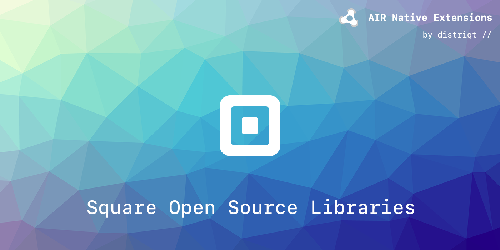

built by [distriqt //](https://airnativeextensions.com) 

# Square Libs

Shared library AIR Native Extensions that include the [Square open source libraries](http://square.github.io/). 

These ANEs are to be used in combination with distriqts extensions. However they can be used 
with any ANEs and are just support ANEs packaging the square open source libraries.

- `okhttp`: An HTTP and HTTP/2 client for Android and Java applications
- `picasso`: A powerful image downloading and caching library for Android

## Native Extensions

The highest quality and widest range of Native Extensions for Adobe AIR

With over 40 extensions available, we are the largest provider of native extensions for AIR developers. 
Our mobile solutions allow developers to fast-forward development and focus on building great games and apps.

https://airnativeextensions.com

